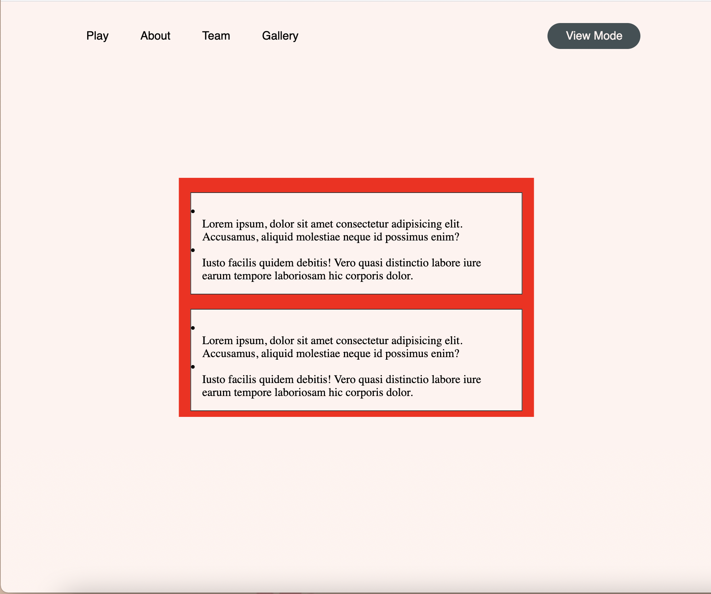
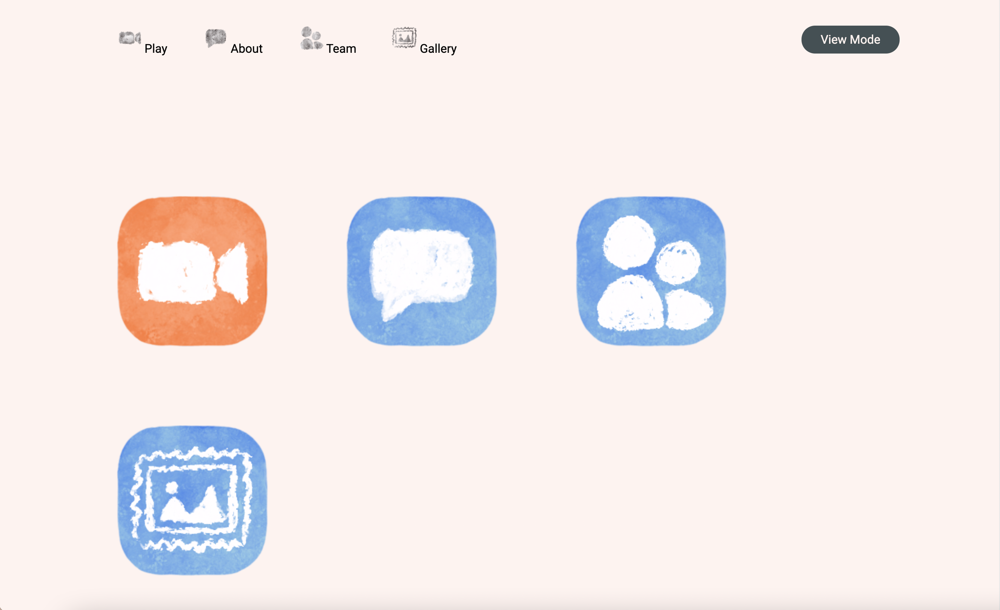
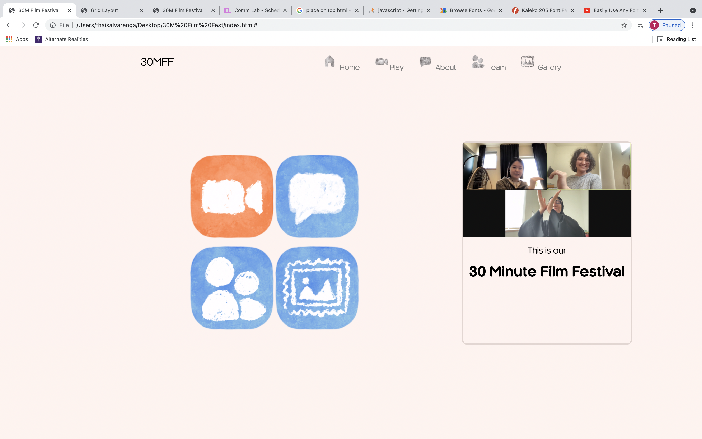
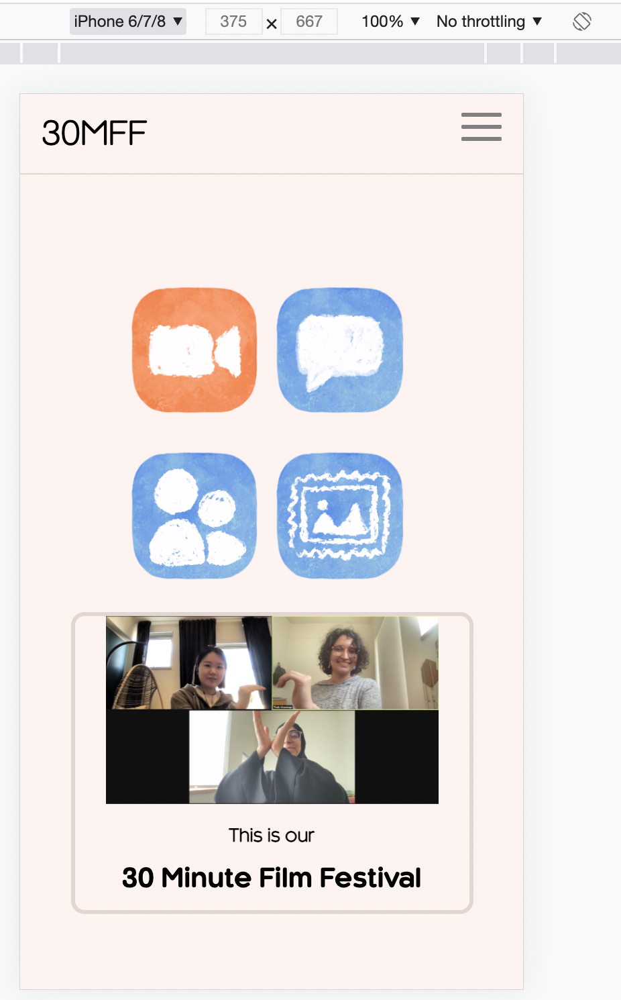
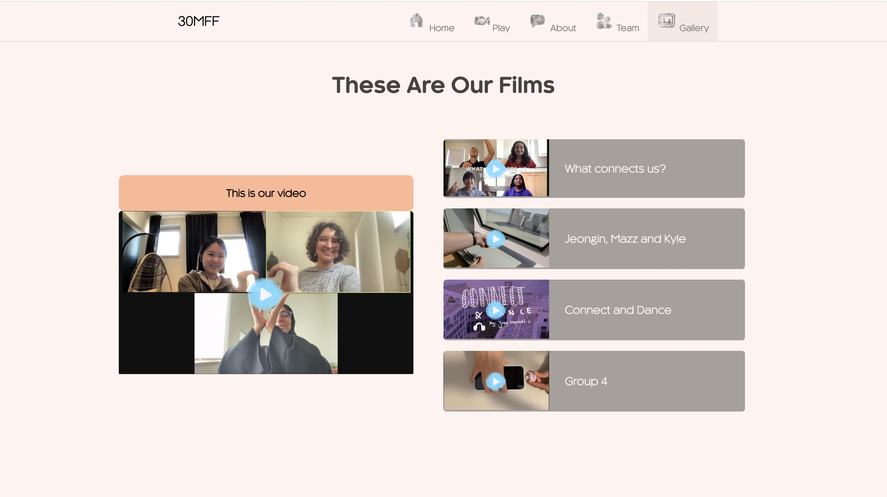
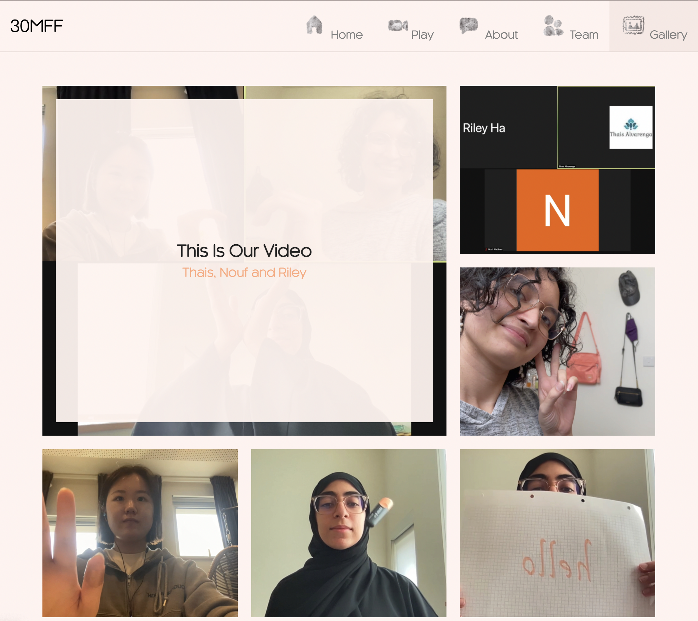
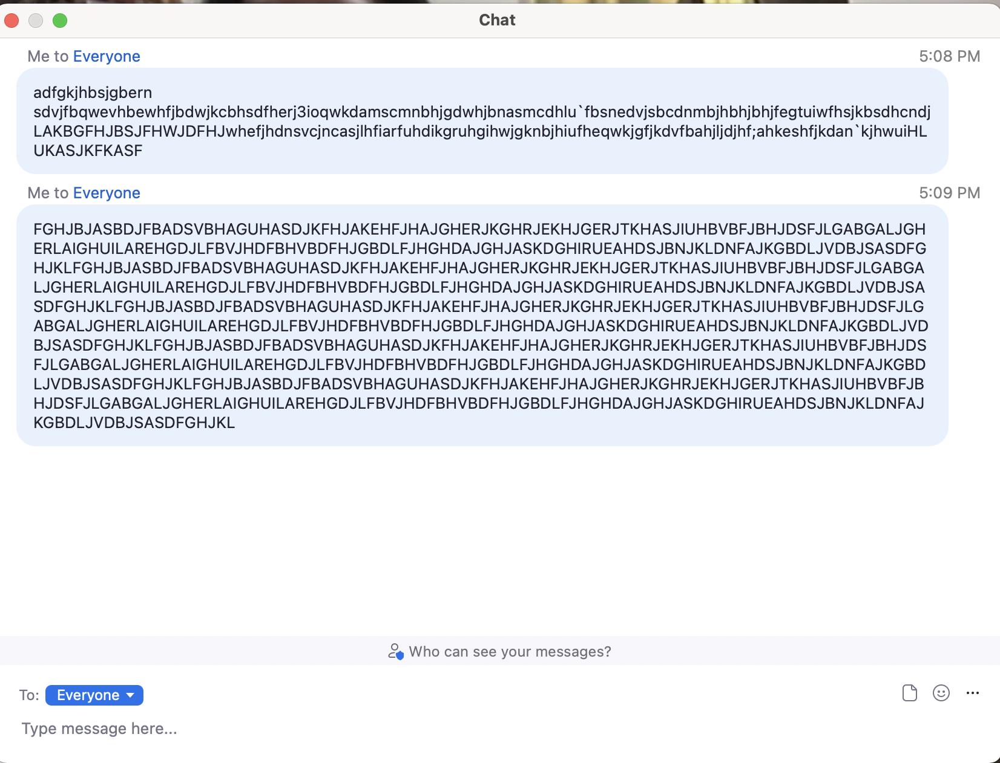
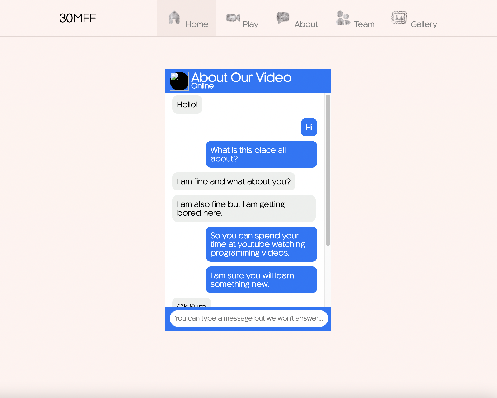
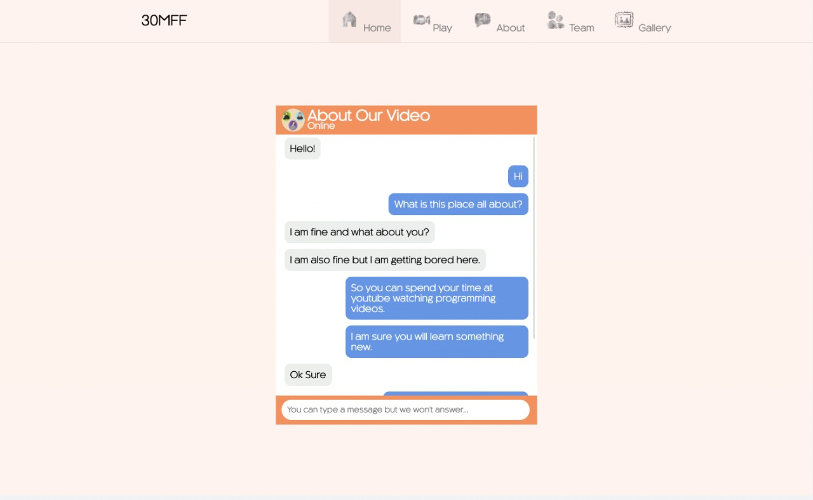
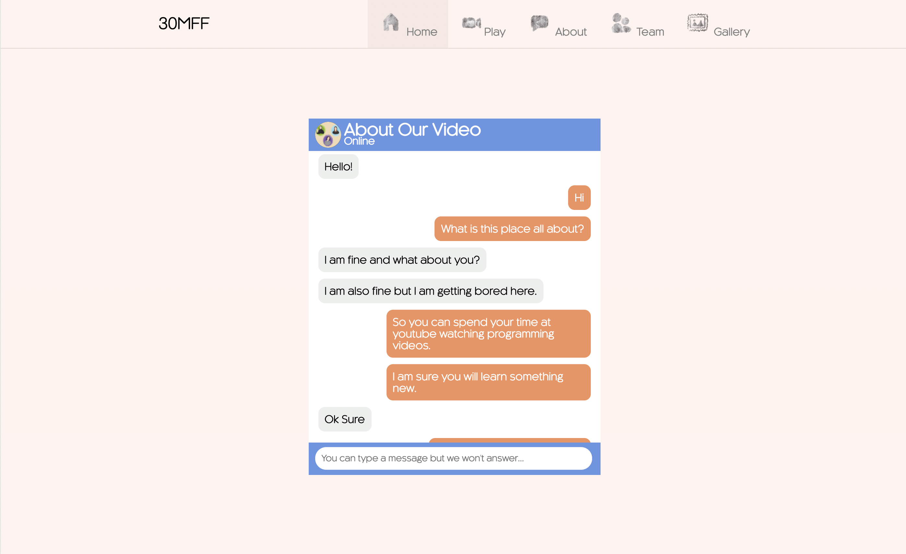

# 30M-Film-Fest

## Description
This is the website I made for our first assignment regarding the 30 Minute Film Festival Video. 

Our video, titled very intelligently as This Is Our Video, describes how even though our interactions have been confined to the online environment due to the pandemic, we are still able to create communial environments and connect with each other through seemly cold technologies such as Zoom, in order to sustain the social yearnings that we human beings have. 

To showcase this, I created a simple website that showcased the warmth and coziness that getting used to Zoom and social distancing has created. In other words, I wanted to create a digital space that would feel welcoming to the user whilst at the same time maintaining a sense of novelty in each sub-page. 

My visual inspiration came from the Zoom.us meetings interphase and I took elements from the icons and layouts that the company uses and gave them my own twist to give them a more personal and homey touch. For this reason, I created all the UI that you see in the sites, plus choosing a color palette that would complement the original colors of the zoom meeting but inclining them towards warmth. 

Additionally, in each page I tried to incorporate something interactive to make the webpage interesting for the user. 

## Process

After some hours trying to do the styling for the original concept of the wireframe that I had, I decided to re-invent the layout I had placed originally. <a href="re-wireframing.pdf"> This is the pdf </a> in which I drew the new wireframe as well as a few notes on what I did and what I changed. 

### Home/Main Page
Before doing the main page, I decided to experiment around with ideas on how to place things on the screen. 

After fidgeting a bit more I started to add the elements. The icons I found on the internet were not really adding to making the webpage have that cozy feel so I decided to create my own icons.

Once the main page looked like I had envisioned, I then worked on making the site responsive. It's not that good but it gets the job done once you get on certain measurements. 

Desktop:
 

Phone:
 

Notes from the first day:
- It took me a whole day.
- It was very hard to make the website responsive.
- Using grids was useful but it also came with its perks. For instance it is very hard to position and take into consideration objects that are not within that grid. 
- Also keeping track of what things have a certain position and relative to what they should be centered.
- Overall, a major problem was keeping track of what was inside what, what elements inside another should be styled as part of that elements and which can be styled overall. 
- Additionally, keeping track of files is also very important and it is very easy to miss
- Spelling mistakes were also very common 
- I learned how to use click on Javascript yay!
- I wanted to have a dark mode (view mode button) option but I ended up not liking the idea. 

### Play Page
What became the play page actually started as my gallery page, but as I was working on it, I realized that the layout was much better suited for the play page and thus added some javascript so that it could become interactive and play if the user clicked the play icon. One thing I struggle with after I pushed the code to GitHub was the autoplay. In my local file it worked perfectly fine but for some reason once I uploaded it, the feature video would autoplay. I also made the UI for this just so that the appearance would match the aesthetic of the rest of the website better. I also added the videos of my other classmates because I though it would be nicer than having more images of the video. 

### Gallery 
For the gallery I decided to use a grid system by making rows and columns dividers and then placing them on a grid. I then tried to make it more complex by adding a card with the name of the video and the group members once it hovers. I really wanted to try transitions so I also incorporated them and as a final touch I added links to the projects of my classmates. 
 

### Team Page 
I got the idea for the Team page after watching a <a href="https://youtu.be/ntg6tbGxP3k">video about</a> how to do parallax effect on html, css and javascript, and I thought it would be interesting to implement it but using images of ourselves instead of the planets. 
Additionally I wanted the appearance to be similar to the way people's cameras are showcased in Zoom, but at the same time, I also wanted to have an element that showcased how we have in a way re-shaped zoom to become part of our social environment. Thus I decided to change the shape of the rectangle on zoom for a circle. 

To give the design more character, I decided to make my own minimalistic drawings with a similar texture to the UI elements I did previously, instead of using screenshots from the video. At the end, I came up with this: 

  
- I decided to use colors that would contrast with my orginal color palette and at the same time would also compliment some of the colors from the skin or clothes that the girls are wearing. 

### About Page
The About page was inspired by the chat in Zoom meetings. I thought that rather than have a box of text telling the user what the page is about, it would be more interesting and engaging to pretend that the people who created the website are having a chat with the user, kinda predicting the questions that the user might have and an overview of how to use the site. Making the chat scrollable, I believe, added to the interaction of this page in particular without actually having to use any script on it. 

I kept the same color palette that was used in the main menu and decided to implement the blue as a way to frame the chat and make it stand out in the screen (I originally inverted the colors but placing the blue outsided, I think, made a difference to what catches the attention first). 

In progress look:

Initial colors:

Final About page: 

## Challenges
- Autoplay of video player (it doesn't happen on my local file but once I pushed it to GitHub it had that issue)
- Positioning things
- Centering things
- Making the web page responsive in a way that looked good 
- Understanding the difference between positionings
- Took me a very long time to do very simple things 
- It's hard to keep track of things, what goes where and who is the child of who
- There are so many ways of doing the same thing that it's hard to know which way would be best
- Javascript had a learning curve, but right now I'm just a straight line. 

### To keep in mind for the future

- Improve my ability to place things and use grids to make the website responsive
- Being more tidy with the code 
- Having better transitions for some things.
- Trying to design for the phone screen first and then work my way up to desktop screen sizes. 
- Learn more javascript 
- I really like the hamburger navigation bar, I want to keep on building from it
- I didn’t got to use animations, so I would like to do that sometime 

## Reflection
I am very happy with how the page looks on a desktop (how it looks on an iPad or phone is debatable). I really enjoyed thinking about how the UI elements could contribute to the theme of my webpage and set a tone for it. It was very hard for me to keep track of things on the CSS files and centering things was a hazzle. I realized just how long of a route I have to follow to get proficient at making websites but I am looking forward to the possibilities of storytelling that each class creates. 

